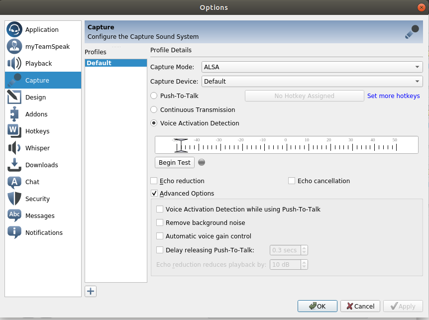
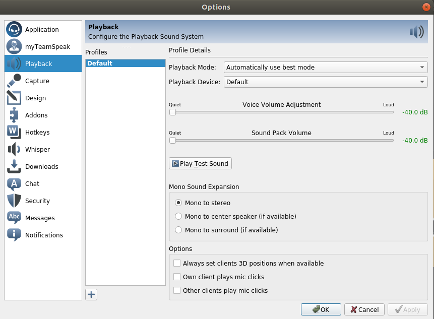
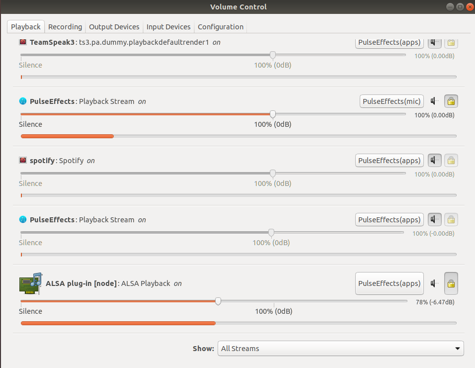
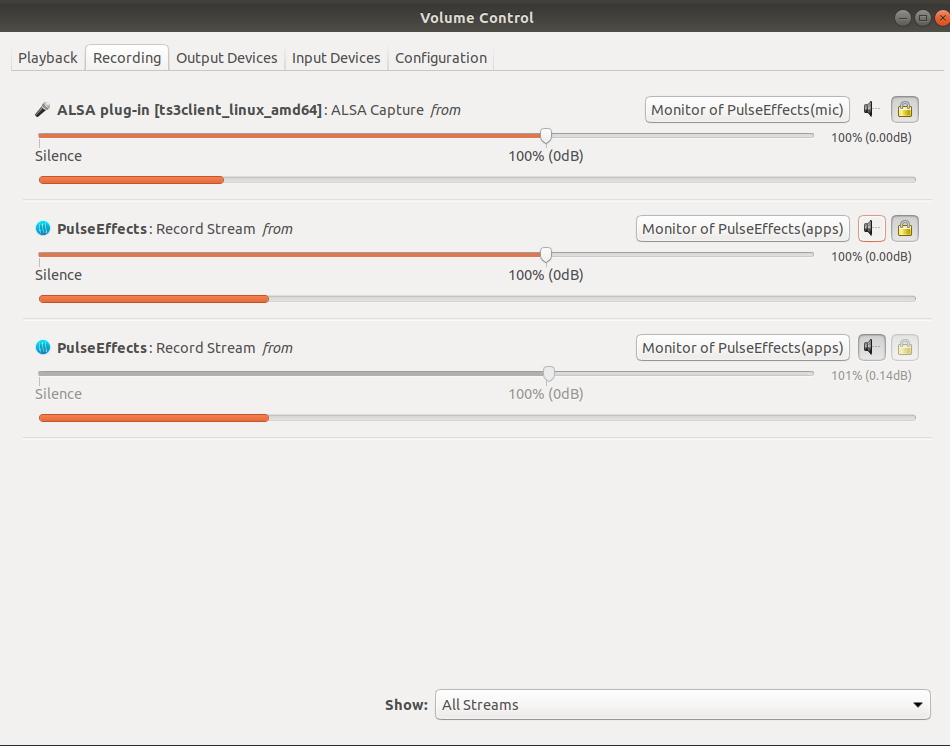
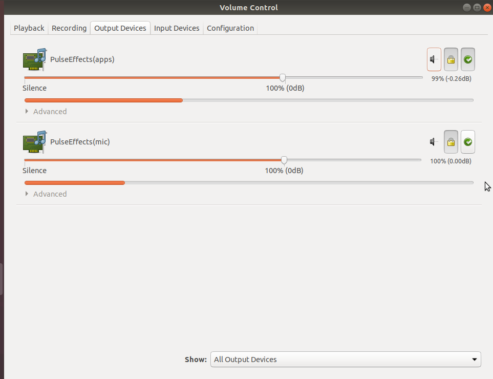
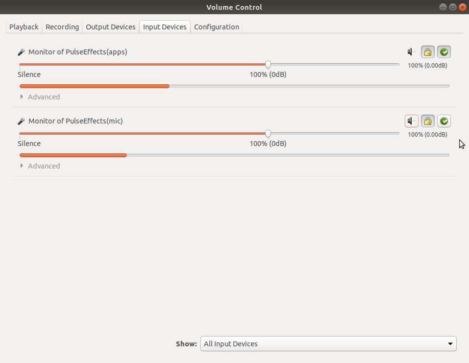

# TeamSpeak 3 Music Bot

#### TeamSpeak 3 Music Bot in Node.js with some cool features

Watch the demo: https://streamable.com/crtqz

Features:

- Music

  - adding songs to the queue
  - adding playlists (with a shuffle option)
  - skipping current song, removing last added song and more
  - getting the title of the current song
  - listing songs in the queue
  - more (see below)

- Other
  - sending a welcome message with some statistics to every user that joins our server

## Installation

Tested with Node 14+ on Linux, Ubuntu.
It may also work on Windows, but has not been tested.

You will need [Node.js](https://nodejs.org/en) (at least version 14), [ffmpeg](https://ffmpeg.org),
[TeamSpeak3 Client](https://teamspeak.com/en/downloads), libasound2-dev (if on Linux) and desktop environment
(to launch the TS3 Client).

Bot listens for commands using ServerQuery account, so you need to provide login and password.
To reset the password, check: https://support.teamspeak.com/hc/en-us/articles/360002712898

### Step 1

- Clone this repo to your local machine:

```shell
git clone https://github.com/xDroni/TS3-Music-Bot.git
```

### Step 2

- Install packages:

```shell
npm install
```

> The main dependency (`ytdl-core`) is frequently updated.
> In case of any problems, try
> `npm update ytdl-core` first.

### Step 3

- (optional) Copy your YouTube API key into the config.json file, it's located in the src/ directory. This is not necessary, but may speed up the search slightly.
- (optional) If you want to play age-restricted videos, fill in the cookiesArray field in config.json, the cookiesString field will be generated automatically. An easy way to get cookiesArray is to sign in to your verified YouTube account and use a plugin like EditThisCookie (tested on Chrome).

### Step 4

- Launch your TeamSpeak 3 Client and connect to the server.

### Step 5

- On the same machine run the music bot with the following parameters (clientname is the name of the user you set in step 4):

```shell
npm start host="server_address" login="query_login" password="query_password" botname="MusicBotName" clientname="ClientName"
```

### (optional) Auto-restart bash script (on error)

```shell
#!/bin/bash
while true
do
    npm start host="server_address" login="query_login" password="query_password" botname="MusicBotName" clientname="ClientName"
    sleep 1
done
```

> If you run the bot with this script, it will automatically restart in case of an unexpected error.

### TeamSpeak 3 client capture settings





_(optional part)_

My sound settings using PulseEffects with equalizer

ALSA plug-in [node] will appear when you add the song to the queue









## Usage

Once you have everything set up, you can start using commands.

### Music

##### Add song to the queue

`!play <title or link to the song>`

> `alias: !s and !sr`

##### Add playlist

`!playlist <link to the playlist>`

> `alias: !p`
>
> > Note that the regular queue has priority over the playlist.

##### Add a playlist and shuffle it

`!p m/mix/shuffle <link to the playlist>`

> ##### You can also shuffle the playlist later using
>
> `!m`, `!mix` or `!shuffle`

##### List the next 5 songs in the queue / playlist

`!list`

> `alias: !l`

##### Get the title of the current song

`!current`

> `alias !c`

##### Skip the current song

`!skip`

##### Remove the last added song from the queue

`!skiplast`

> `alias !sl`

##### Remove all songs from the queue

`!skipall`

> `alias !sa`

##### Get the queue length

`!size`

> `alias !length`

##### Play the previously played song

`!previous`

> `alias: !last`

### Other

##### Exit the music bot

`!exit`

> If you run the bot using the auto-restart script, the !exit command will also work as an on-demand restart.
